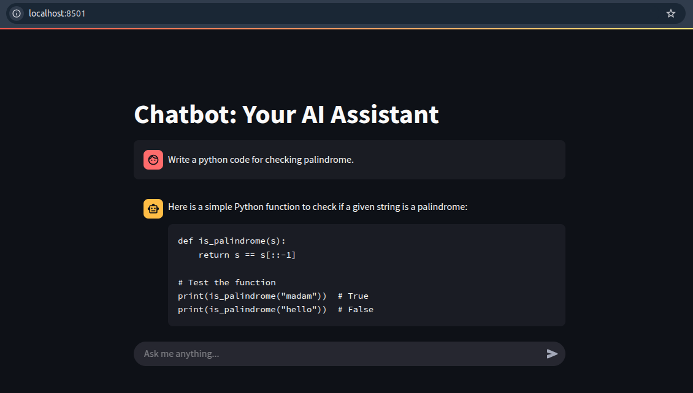

# Chatbot: Your AI Assistant (Powered by Ollama & Streamlit) 🚀
**Author:** [Md Rasul Islam Bapary]  
**Date:** [13.05.2024]\
\
A lightweight **AI chatbot** using **LLaMA 3**, built with **Streamlit** and **Ollama** for seamless interaction. This repository is created to learn Streamlit(a open-source python library) that allows to create interactive web applications for machine learning, data visualization, and data analysis.

---

## 📌 Features  
✔️ Chat with **LLaMA 3** locally  
✔️ **Streaming responses** for real-time conversations  
✔️ **User-friendly UI** powered by **Streamlit**  
✔️ **No API key required** – runs **entirely offline**  

---

## 🔧 Installation  

### 1️⃣ Install Dependencies  
Run the following command to install required Python libraries:  
```bash
pip install streamlit ollama
```
### 2️⃣ Install Ollama (if not installed)
To use LLaMA 3 or any other ollama model, you need to install Ollama:

#### 🖥️ Linux & macOS
```bash
curl -fsSL https://ollama.com/install.sh | sh
```
#### 🖥️ Windows
Download and install Ollama from the official website: [Ollama Installation](https://ollama.com/)

### 3️⃣ Download LLaMA 3 Model
Once Ollama is installed, download the LLaMA 3 model:

```bash
ollama pull llama3
```
## 🚀 Running the Chatbot
After installing dependencies, start the chatbot by running:

```bash
streamlit run Ollama_chatbot.py
```
### 📸 Screenshot


### 🛠️ Contributing
Contributions are welcome! Feel free to fork this repo, create a new branch, and submit a pull request.

**💡 If you find this project useful, don't forget to ⭐ star the repository!**